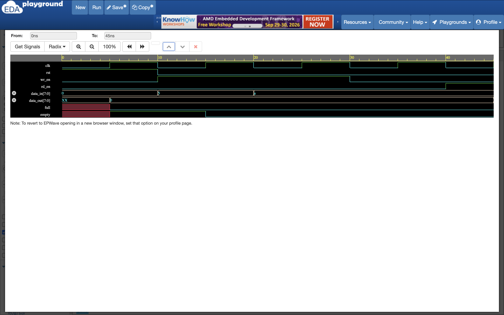
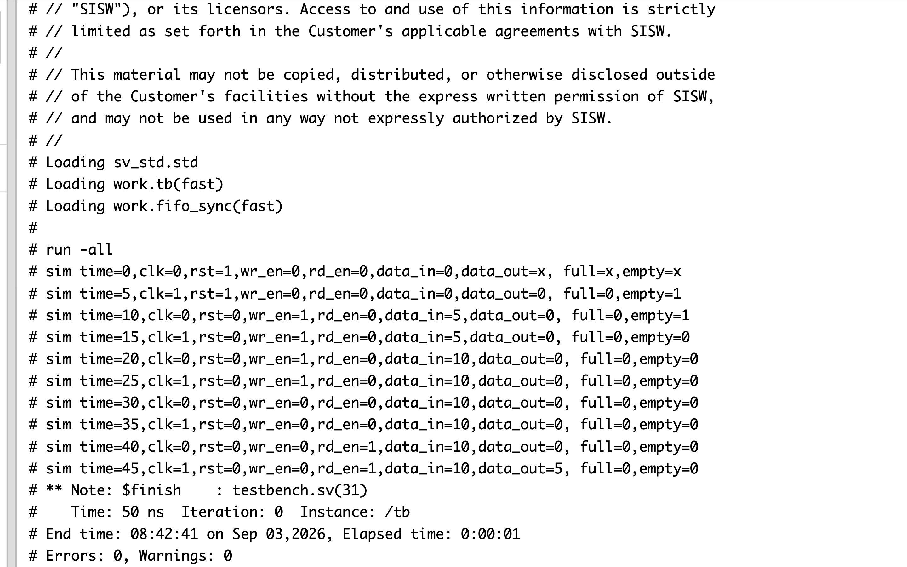

# Synchronous FIFO RTL Design & Verification using Verilog HDL

## Overview

This project implements a synchronous First-In First-Out (FIFO) memory using Verilog HDL. The FIFO uses a single clock for both read and write operations and includes read/write pointer-based control logic along with full and empty status flags.

The design was simulated and verified using QuestaSim.

---

## Design Specifications

| Parameter | Description |
|-----------|-------------|
| Data Width | 8 bits |
| Memory Size | 8 locations |
| Clock | Single synchronous clock |
| Reset | Active-high synchronous reset |
| Write Enable | `wr_en` |
| Read Enable | `rd_en` |
| Data Input | `data_in[7:0]` |
| Data Output | `data_out[7:0]` |
| Status Flags | `full`, `empty` |
| HDL | Verilog HDL |
| Simulation Tool | QuestaSim |

---

## FIFO Architecture

The FIFO consists of:

- 8-bit wide memory array
- Write pointer
- Read pointer
- Write control logic
- Read control logic
- Full status detection
- Empty status detection
- Synchronous reset logic

### Basic Operation

```text
                 +----------------------+
data_in -------->|                      |
wr_en ---------->|    WRITE CONTROL     |
                 |          |           |
                 |          v           |
                 |       Memory         |
                 |          |           |
                 |          ^           |
rd_en ---------->|    READ CONTROL      |
                 |                      |
                 +----------------------+
                       |          |
                      full      empty
```
## RTL Implementation

The FIFO uses:

- `wr_ptr` to identify the memory location for the next write.
- `rd_ptr` to identify the memory location for the next read.
- `mem` as the FIFO storage.
- `full` to prevent writing when the FIFO is full.
- `empty` to prevent reading when the FIFO is empty.

## Working

### Write Operation

When `wr_en` is high and the FIFO is not full, `data_in` is written into the memory.

```text
wr_en = 1 && full = 0
```

The write pointer is incremented after the write operation.

### Read Operation

When `rd_en` is high and the FIFO is not empty, data is read from the memory.

```text
rd_en = 1 && empty = 0
```

The read pointer is incremented after the read operation.

### Empty Condition

```text
empty = (wr_ptr == rd_ptr)
```

### Full Condition

```text
full = ((wr_ptr + 1'b1) == rd_ptr)
```

## Simulation

The testbench verifies:

- Reset operation
- Write operation
- Read operation
- FIFO data ordering
- Full condition
- Empty condition

### Test Sequence

1. Apply reset
2. Write data `5`
3. Write data `10`
4. Disable write operation
5. Enable read operation
6. Verify output data

## Files

- `Synchronous_FIFO_design.v` – FIFO RTL design
- `Synchronous_FIFO_tb.v` – Testbench
- `simulation_output.png` – Simulation output
- `waveform.png` – Simulation waveform
- `README.md` – Project documentation

### FIFO Simulation Waveform




### Simulation Output



## Tools Used

- Verilog HDL
- EDA Playground
- EPWave

## Result

The Synchronous FIFO was successfully designed and simulated. The simulation verifies correct FIFO read/write operation, data ordering, and `full`/`empty` status flags.
